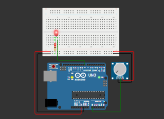

# Project RTOS Arduino: Kontrol LED dengan Sensor Potensiometer

## Deskripsi
Project ini menggunakan **Real-Time Operating System (RTOS)** pada Arduino untuk menjalankan beberapa task secara bersamaan (multitasking). Sistem membaca nilai dari potensiometer, kemudian mengatur kecepatan kedipan LED, serta menampilkan data ke Serial Monitor.

---

## Konsep Sistem
Program terdiri dari **3 task utama**:
1. **TaskSensor** → membaca nilai potensiometer  
2. **TaskLED** → mengatur kedipan LED berdasarkan nilai sensor  
3. **TaskSerial** → menampilkan data ke Serial Monitor  

Ketiga task berjalan secara **concurrent (bergantian cepat)** menggunakan scheduler dari FreeRTOS.

---

## Alat dan Bahan
- Arduino Uno  
- Potensiometer  
- LED  
- Resistor 220Ω  
- Kabel jumper  
- Breadboard  

---

## Penjelasan Kode

### 1. Library dan Konstanta
```cpp
#include <Arduino_FreeRTOS.h>
#include <semphr.h>
#define LED_PIN 8
#define SENSOR_PIN A0
```

---

### 2. Variabel Global dan Mutex
```cpp
SemaphoreHandle_t mutex;
volatile int sensorValue = 0;
```

---

### 3. Setup
```cpp
void setup() {
  Serial.begin(9600);
  mutex = xSemaphoreCreateMutex();

  xTaskCreate(TaskSensor, "Sensor", 100, NULL, 2, NULL);
  xTaskCreate(TaskLED,    "LED",    100, NULL, 1, NULL);
  xTaskCreate(TaskSerial, "Serial", 100, NULL, 1, NULL);

  vTaskStartScheduler();
}
```

---

### 4. TaskSensor
```cpp
void TaskSensor(void *pvParameters) {
  while (1) {
    int val = analogRead(SENSOR_PIN);

    if (xSemaphoreTake(mutex, 5)) {
      sensorValue = val;
      xSemaphoreGive(mutex);
    }

    vTaskDelay(200 / portTICK_PERIOD_MS);
  }
}
```

---

### 5. TaskLED
```cpp
void TaskLED(void *pvParameters) {
  pinMode(LED_PIN, OUTPUT);

  while (1) {
    int val = 0;

    if (xSemaphoreTake(mutex, 5)) {
      val = sensorValue;
      xSemaphoreGive(mutex);
    }

    int delayLED = map(val, 0, 1023, 100, 700);

    digitalWrite(LED_PIN, HIGH);
    vTaskDelay(delayLED / portTICK_PERIOD_MS);

    digitalWrite(LED_PIN, LOW);
    vTaskDelay(delayLED / portTICK_PERIOD_MS);
  }
}
```

---

### 6. TaskSerial
```cpp
void TaskSerial(void *pvParameters) {
  while (1) {
    int val = 0;

    if (xSemaphoreTake(mutex, 5)) {
      val = sensorValue;
      xSemaphoreGive(mutex);
    }

    Serial.print("Sensor: ");
    Serial.print(val);
    Serial.print(" | Delay LED: ");
    Serial.println(map(val, 0, 1023, 100, 700));

    vTaskDelay(500 / portTICK_PERIOD_MS);
  }
}
```

---

## Cara Kerja Sistem
1. Potensiometer diputar → nilai analog berubah  
2. TaskSensor membaca nilai tersebut  
3. TaskLED mengubah kecepatan kedipan LED  
4. TaskSerial menampilkan data ke Serial Monitor  

---

## Hasil
- LED berkedip dengan kecepatan berbeda  
- Serial Monitor menampilkan nilai sensor dan delay  
- Sistem berjalan stabil tanpa blocking  

---

## Desain Rangkaian

Berikut adalah tampilan rangkaian pada Tinkercad:



---

## Link Simulasi 
Klik link berikut untuk melihat dan menjalankan simulasi:

https://wokwi.com/projects/463057325068518401

---

## Kesimpulan
- RTOS memungkinkan multitasking pada Arduino  
- Penggunaan mutex mencegah konflik data  
- Sistem lebih terstruktur dibanding loop biasa  
